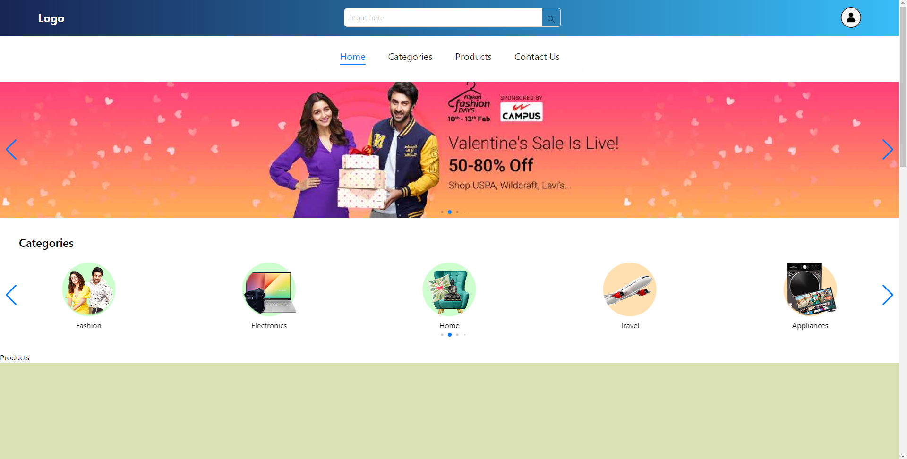
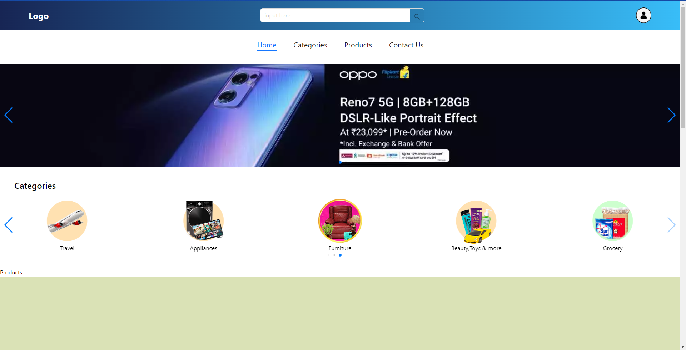
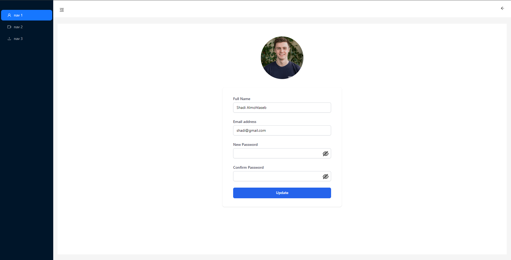

# Learining MERN 

in this project, I used react.js and tailwind CSS and ant design for my frontend and node.js and express for the backend you can make an account and login and logout with protected routes

## Learning Objectives

 - JWT Auth (Token)
 - JOI Validation
 - Hashing the password
 - save the token in the cookies
 - make protected routes for user and admin
 - CRUD operation
 - Ant Design and Tailwind CSS And Toast notification for the front-end
 - Redux toolkit to manage my states

## Demo

https://learn-mern-stack.vercel.app/

## App Preview

